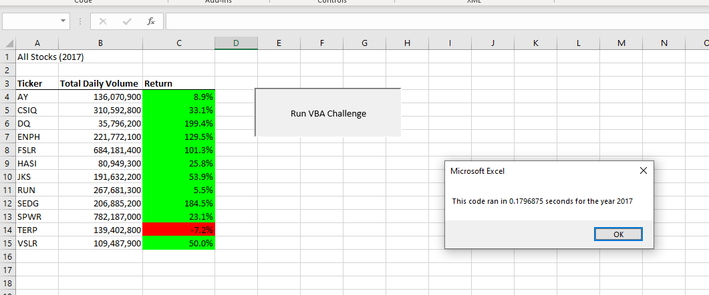
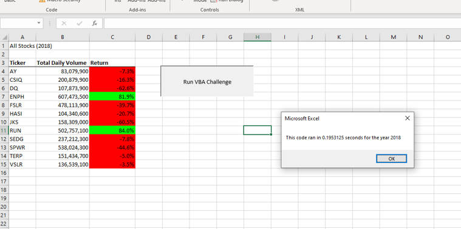

# Select Stock Analysis for 2017 and 2018

## Overview of Project
This VBA script will analyze select stocks from 2017 and 2018 in order to draw conclusions on whether or not these stocks would make for sound investments in the year 2019 for our client.

## Script Notes
This script was written with performance in mind so that it may be scaled to a larger set of selected stocks to analyze. Prior to enhancements made to the script logic the execution time of the files 2017 and 2018 were roughly **0.496** and **0.484** seconds respectively. After enhancments to the script the execution time of the files dropped to **0.179** and **0.195** seconds respectively. This improvment was made by only traversing the file a single time, instead of looping through the entire file multiple times.

# 2017 Analysis

- [Select 2017 Stocks Downdload (png)](resources/VBA_Challenge_2017.png)

The data suggests that all but one one of the selected stocks are strong canidates for investment. The stock 'TERP' was the only chosen stock to underperform, and the stocks 'DQ', 'ENPH', 'FSLR', and 'SEDG' are all dramatically overperforming. These stocks should be looked into within the 2018 reporting to see if these gains continued or if they fell.

# 2018 Analysis

- [Select 2018 Stocks Downdload (png)](resources/VBA_Challenge_2018.png)

The data shows in the year 2018 a majority of selected stocks fell in performance. As for stocks that were on the watch list from 2017 we can see:
- 'DQ' dramatically underperformed and would be seen as a risky investment
- 'ENPH' performed very well, and could be seen as a strong investment for 2019
- 'FSLR' underperformed and would be seen as a risky investment
- 'SEDG' slightly underperformed, more insights may be needed to determine the validity of this stock as an investment in 2019

## Notes on Refactoring Code
### In General
In general code refactoring is not always seen as an "optimal" expense of resources. Code refactoring is done for many reasons, some are:
- increase the readability of code
- utilize new, exciting, or 'pretty' styles of code
- lower the technical debt or expense that the code takes to execute, i.e. time, CPU power, database space, etc...
- update the code to be more secure or to clear out code that may be out of date

While all of these things are good things to strive for, often code refactoring can eat up more time or resources than are saved. In the age of cloud computing and ultra fast CPUs/GPUs the largest cost that many companies feel in their development team is the hourly cost of their coders, and having these coders spend many hours refactoring functional code can lead to massive losses in productivity and increased costs to the company. In general refactoring old functional code is going to be a case by case decision every time, there is no clear answer for if/ when it is worth doing.

### VBA Challenge Refactoring
In the case of this challenge, I believe that refactoring the code to decrease execution time was a relavent and important step to take. The execution times for this code were cut in half by these improvements, which means that this same approach can now be used to great affect with a much larger dataset. A key reason that refactoring was worth while in this case is simply that the fault with the code was clear and there were quick and easy steps that could be taken to remedy the problem without long dev hours. If the refactoring had taken doubling or tripling the footprint of the lines of code, or taken days of research to determine a viable alternative, then refactoring would not have been such a clear path forward.

